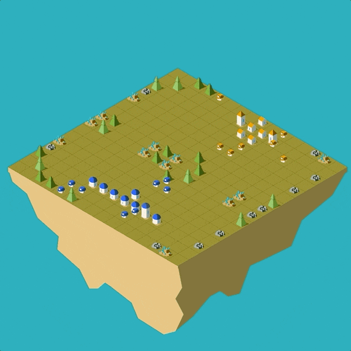

# Project 2: Lux AI Challenge

This is our solution of the Kaggle [Lux AI Challenge Season 1](https://www.kaggle.com/c/lux-ai-2021).

In order to solve the questions above, we take three methods: Rule-based strategy, Reinforcement-learning strategy and Imitation- learning strategy. In short, for each method, we have respectively done the following works:

1. Rule-based: Manually design rules and teach the model to follow the rules (just like human playing)
2. RL: Use Deep Q Network (DQN) architecture, introduce the expert experience and design a reward function
3. IL: Add data, replace the origin backbone with UNet and manually add rules to prevent totally wrong decisions

For more details, please refer to our code and the [paper](https://github.com/Dou-Yiming/CS410-Projects/blob/main/project2/report/Group2_AI_report.pdf).

Our final ranking: 115 / 1178 teams.

Group Members:

- [Yiming Dou](https://github.com/Dou-Yiming)
- [Xinhao Zheng](https://github.com/void-zxh)
- [Yutian Liu](https://github.com/stau-7001)
- [Qing Yang](https://github.com/hushyangqing)